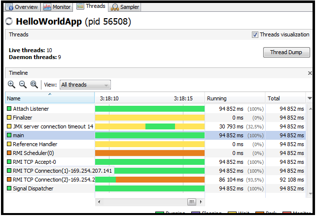

# <a name="Home"></a> Concurrency

## Содержание:
- [Обзор](#Overview)
- [Thread](#Thread)
- [Runnable](#Runnable)
- [Callable and FutureTask](#Callable)
- [Executor](#Executor)
- [ThreadPoolExecutor](#ThreadPoolExecutor)
- [Executor Service](#ExecutorService)
- [Executor Service Static Methods](#ExecutorServiceStaticMethods)
- [ScheduledExecutorService](#ScheduledExecutorService)
- [ForkJoinPool](#ForkJoinPool)

## [↑](#Home) <a name="Overview"></a> Обзор
Для проб нам понадобится: [Sublime Text 3](https://www.sublimetext.com/3). Он весит всего около 8.5 мб, в отличии от остальных монстров.
При первой установке отсутствует важный инструмент - Package Control. Для его установки необходимо не выходя из Sublime Text через главное меню выбрать "Tools" → "Install Package Control".

Нам нужно для Sublime Text 3 настроить сборки, то есть Build System. Для этого:
- Выбрать в меню "Tools" -> "Build System" -> "New Build system"
- Указать между фигурными скобками: "cmd": ["java", "$file_base_name"]
- Нажать Ctrl+S
- Сохранить под названием: **Java.sublime-build**

Далее, возьмём за основу пример [Oracle Hello World Example](https://docs.oracle.com/javase/tutorial/getStarted/application/index.html):
```java
class HelloWorldApp {
    public static void main(String[] args) {
        System.out.println("Hello World!"); // Display the string.
    }
}
```
И сохраняем его как **HelloWorldApp.java**.
После этого, в меню выбираем "Tools" -> "Build With" (а лучше пользуемся HotKey), выбираем JavaC (компилятор Java).
После этого через Build With выбираем ранее сохранённый профиль из Java.sublime-build. В результате мы увидим на консоле тот самый текст Hello World.

Давайте теперь изменим метод main:
```java
public static void main(String[] args) {
	while(true) {}
}
```
Скомпилируем (JavaC) и запустим (Java).
Теперь, воспользуемся **[Java Virtual Machine Process Status Tool](https://docs.oracle.com/javase/7/docs/technotes/tools/share/jps.html)**. Например, в Windows мы можем нажать **Win+R**, выполнить **cmd**. Выполняем команду **jps**.
Мы видим список всех **Java процессов**, запущенных в текущий момент. В том числе мы увидим строчку вида: ```56508 HelloWorldApp```. Первое число будет меняться и представляет собой **Process Id (pid)**.
Про процессы рекомендуется прочитать в статье "[Многопоточность в Java](https://habrahabr.ru/post/164487/)", а так же в ответах из "[Собеседование по Java — многопоточность (вопросы и ответы)](http://javastudy.ru/interview/concurrent/)".

Теперь давайте воспользуемся стандартной утилитой: [Jstack](https://docs.oracle.com/javase/6/docs/technotes/tools/share/jstack.html). В командной строке выполним: **jstack 56508**, где номер - это наш найденный pid.
Мы увидим, что написано: ```Full thread dump```, то есть это дамп потоков.
Дамп потоков содержит список всех потоков, из которых состоит наш процесс, на момент выполнения команды.

Так же мы можем воспользоваться UI утилитой, входящей в поставку JDK: [jvisualvm](https://docs.oracle.com/javase/7/docs/technotes/guides/visualvm/index.html). Её тоже можно запустить сразу для нужного процесса, например: **jvisualvm --openpid 56508**.
В данной утилите на вкладке Threads мы увидим все текущие потоки:

Кнокой **Thread Dump** в отдельной вкладке можно открыть Thread Dump текущего состояния. Там можно будет увидеть, какие потоки сейчас есть и в каком они состоянии.

Итак, получается, что внутри одного процесса выполняется множество потоков, называемых Thread.
Поиск в гугле по **"java thread"** выдаст одной из первых ссылку на Java API: [java.lang.Thread](https://docs.oracle.com/javase/7/docs/api/java/lang/Thread.html).
Тут стоит обратить внимание на это:
```
When a Java Virtual Machine starts up, there is usually a single non-daemon thread (which typically calls the method named main of some designated class).
```
То есть когда в JVM запускается новый java процесс, то у нас выполнение начинается с создания одного не демон потока (**non-daemon thread**), который обычно имеет имя **main**.
Когда все не демон потоки завершатся - завершится и java процесс.

Чтобы остановить наш Build процесс в sublime Text мы можем нажать **Ctrl+Break** или убить процесс (в Windows это taskkill /pid НомерПроцесса).

У Oracle есть целый раздел, посвящённый многопоточности: "[Lesson: Concurrency](https://docs.oracle.com/javase/tutorial/essential/concurrency/index.html)".

## [↑](#Home) <a name="Thread"></a> Thread
Итак, мы узнали, что Java программа - это некий процесс, внутри которого существует набор потоков. Поток описывается классом Thread.
Ещё раз посмотрим на java api данного класса: [Thread class](https://docs.oracle.com/javase/7/docs/api/java/lang/Thread.html). Мы увидим, что данный класс имеет набор статических методов. Одним из них является метод [currentThread](https://docs.oracle.com/javase/7/docs/api/java/lang/Thread.html#currentThread(). Собственно, он возвращает ссылку на текущий поток. Таким образом, мы можем получить различные данные текущего потока: демон ли он, в каком состоянии и т.д.:
```java
public static void main(String[] args) {
	Thread thread = Thread.currentThread();
	System.out.println("Name: " + thread.getName());
	System.out.println("isDaemon: " + thread.isDaemon());
	System.out.println("Group: " + thread.getThreadGroup());
}
```
Или можем, например, вывести все потоки, которые не демоны:
```java
public static void main(String[] args) {
	for (Thread thread : Thread.getAllStackTraces().keySet()) {
		if (!thread.isDaemon()) {
			System.out.println(thread);
		}
	}
}
```
И действительно, из всех потоков только **main** наш является не демон потоком. Поэтому, когда он завершается, то завершается и выполнение всех остальных потоков. А с этим завершается и выполнение программы, т.е. завершается процесс.

**Daemon Threads** (Демон потоки) - это служебные потоки. Они не должны выполнять занятие каких-либо ресурсов, т.к. их остановка может произойти в любой момент времени и корректное завершение работы не гарантируется. Поэтому, стоит избегать использования каких либо ресурсов во избежании нарушения целостности данных.
```java
System.out.println(Thread.currentThread().isDaemon());
```

**java.lang.ThreadGroup** - Потоки организованы в группы. Каждая поток присоединён к какой-либо группе. Это позволяет получить список потоков группы. Группы могут образовывать иерархию по типу Родительский элемент - дочерние элементы.
Пример получения названия группы текущего потока:
```java
System.out.println(Thread.currentThread().getThreadGroup());
```

**Thread.State** - у потока есть состояние.
Узнать его очень просто, достаточно выполнить:
```java
Thread.currentThread().getState()
```
**Thread.State** - это enum со следующими значениями:
- NEW : Поток только что создан)
- RUNNABLE : Поток запустили (но не говорит, что он сейчас выполняется)
- BLOCKED : Блокирован другим потоком (ожидает монитор, занятый другим потоком)
- WAITING : Ожидает другой поток (методы wait и notify)
- TIMED_WAITING : Временное ожидание (методы wait и sleep с указанием времени)

Создать и запустить поток легко:
```java
Thread thread = new Thread();
thread.start();
```
Важно, что именно этот метод, запустить, стартовать, **start** создаёт новый поток. Он выполняет некоторые проверки, работу с группами и запускает private native метод start, который и выполняет всю работу по управлению созданием потока и выполняет после этого в новом потоке метод **thread.run**.
У класса Thread есть так же метод метод **thread.run**, который обращается к внутреннему полю **target** (т.е. цель потока), где лежит некое **Runnable**.
Поэтому, выполнение метода run вручную не приведёт к созданию нового потока.
Одним из способов создания потока - унаследоваться от Thread и переопределить метод run, затем вызывая метод start у потока. Но это накладывает ограничение на иерархию, да и не так гибко. Поэтому рекомендуется использовать другой способ - при создании потока использовать **Runnable**.

## [↑](#Home) <a name="Runnable"></a> Runnable
Итак, Thread описывает некий выполняющийся поток. Поток можем начать, для этого есть метод **start**. У потока есть некоторая задача, task, который данный поток должен выполнить. Поэтому, при создании потока мы можем указать то, что должно запускаться, то есть мы хотим Run чего-то, что будет Runnable. Для описания этого существует интерфейс **[java.lang.Runnable](https://docs.oracle.com/javase/7/docs/api/java/lang/Runnable.html)**.

Да, мы должны реализовать некоторую логику, иимплементируя данный интерфейс.
Например:
```java
public static void main(String[] args) {
	Runnable task = new Runnable() {
		public void run() {
			System.out.println("Hello, World!");
		}
	};
	Thread thread = new Thread(task);
	thread.start();
}
```
Важно, что если мы посмотрим внимательнее на код Runnable, то увидим аннотацию над интерфейсом: **@FunctionalInterface**. То есть для описания Runnable можем использовать лямбда выражения:
```java
public static void main(String[] args) {
	Runnable task = () -> { System.out.println("Hello, World!"); };
	Thread thread = new Thread(task);
	thread.start();
}
```
Пустые скобки показывают, что у нас нет входных аргументов.

## [↑](#Home) <a name="Callable"></a> Callable and FutureTask
Runnable это хорошо. Но что, если мы хотим получить результат выполнения? Просто объявить внешнюю для Runnable переменную не выйдет, мы получим ошибку:
```
Variable такая-то is accessed from within inner class, needs to be final or effectively final
```
А если мы хотим получить String? Уже не выйдет. Можно использовать массив из одного элемента или какой-нибудь ещё final контейнер, внутри которого мы будем менять значение. Но попахивает это всё как-то плохо. Разработчики языка Java подумали так же и ввели ещё один интерфейс - **[java.util.concurrent.Callable](https://docs.oracle.com/javase/7/docs/api/java/util/concurrent/Callable.html)**.
Отличается от Runnable тем, что он возвращает результат.
Так же есть особенность, если обратить внимание на то, что:
```
call() throws Exception;
```
То есть исключения внутри данного метода можно не обрабатывать. Чего не скажешь про Runnable и его метод run.

Кроме того, просто так Callable нельзя использовать, т.е. Thread в конструктор принимает только Runnable. Для того, чтобы Callable использовать в Thread необходимо использовать его как часть класса **[java.util.concurrent.FutureTask](https://docs.oracle.com/javase/7/docs/api/java/util/concurrent/FutureTask.html)**.
**FutureTask** - представляет из себя задачу (Task), которая будет выполнена где-то в будущем (Future).
FutureTask может быть создан как по Callable, так и по Runnable.
FutureTask реализует интересный интерфейс - **RunnableFuture**. Он совмещает в себе интерфейс **Runnable** (что позволяет использовать его в Thread) и интерфейс **Future**.

Пример:
```java
public static void main(String[] args) {
	Callable<String> task = () -> {
		String printedText = "Hello, World!";
		System.out.println(printedText);
		return printedText;
	};
	FutureTask<String> futureTask = new FutureTask(task);
	Thread thread = new Thread(futureTask);
	thread.start();
	try {
		System.out.println("Printed: " + futureTask.get());
	} catch (InterruptedException | ExecutionException e) {
		e.printStackTrace();
	}
}
```
Как мы видим, мы обязаны обработать два разных исключения: **InterruptedException** и  **ExecutionException**.
Первое связано с тем, что когда мы вызываем get, то мы останавливаем выполнение текущего потока до того времени, пока не получим данные из futureTask. То есть выполнение становится синхронным. Соответственно, мы можем в этот момент получить сообщение о том, что наш поток должен прервать своё выполнение, поэтому мч должны обработать **Interrupt**.
Второе исключение связано с тем, что Callable предоставляется метод call, который обязывает обрабатывать Exception. Т.е. при выполнении может возникнуть исключения ситуация, о которой мы должны позаботиться.

У FutureTask есть так же есть полезные методы, которые позволяют:
- isDone() - узнать, выполнена ли задача
- isCancelled() - узнать, не отменена ли задача
- cancel() - отменить выполнение задачи

Так же есть перегруженный метод get, которому можно сообщить, сколько мы собираемся ждать ответ от потока (что обяжет нас обработать ещё и TimeoutException):
```java
try {
	System.out.println("Printed: " + futureTask.get(1L, TimeUnit.SECONDS));
} catch (InterruptedException | ExecutionException e) {
	e.printStackTrace();
} catch (TimeoutException e) {
	e.printStackTrace();
}
```

Объект futureTask в методе cancel принимает параметр типа boolean. Если он будет true, то перед отменой задачи будет вызван Thread.interrupt. Это нужно для того, чтобы задача смогла как-то обработать тот факт, что сейчас её собираются отменить. Например, откатить транзакцию, закрыть ресурсы, выполнить логирование и т.п.

Если мы хотим использовать Runnable для FutureTask, то мы должны выполнить:
```java
FutureTask<String> futureTask = new FutureTask(task, null);
```

Тогда метод get вернёт null.
Но мы можем указать здесь любое другое значение, которое вернётся в случае успешного завершениея futureTask. Например:
```java
FutureTask<Boolean> futureTask = new FutureTask(task, true);
```
В случае успеха, futureTask.get вернёт true.

Важно помнить, что при выполнении get по отменённой задаче мы получим: **java.util.concurrent.CancellationException**.
Отменить уже выполненную задачу невозможно.

## [↑](#Home) <a name="Executor"></a> Executor
Начиная с Java 1.5 люди поняли, что как-то свалено в одну кучу создание потоков, логика их выполнения, отправление вообще задач в потоки. Хотелось как-то это всё разделить.
И выразили это желание в виде интерфейса [Executor](https://docs.oracle.com/javase/7/docs/api/java/util/concurrent/Executor.html).
Соответственно, интерфейс **Executor** имеет всего один метод **execute**, который на вход принимает **runnable**.
Предполагается, что любая реализация может по какой-то причине отклонить выполнение задачи и бросить RuntimeException: **RejectedExecutionException**.
Самая примитивная реализация из JavaDoc:
```java
public static void main(String[] args) {
	class ThreadPerTaskExecutor implements Executor {
		public void execute(Runnable r) {
			new Thread(r).start();
		}
	}
	Runnable task = () -> System.out.println("Hello, World!");
	Executor executor = new ThreadPerTaskExecutor();
	executor.execute(task);
}
```

## [↑](#Home) <a name="ThreadPoolExecutor"></a> ThreadPoolExecutor
У интерфейса **Executor** есть реализация - **ThreadPoolExecutor**.

Пример инициализации ThreadPoolExecutor'а:
```java
public static void main(String[] args) {
	int startSize = 1;
	int maxSize = 5;
	long keelAliveTime = 1;
	BlockingQueue<Runnable> workQueue = new ArrayBlockingQueue<>(7);
	Executor executor;
	executor = new ThreadPoolExecutor(startSize, maxSize, keelAliveTime, 				TimeUnit.SECONDS, workQueue);

	Runnable task = () -> System.err.println(Thread.currentThread().getName());
	for (int i = 0; i < 11; i++){
		executor.execute(task);
	}
}
```
На данном примере становится понятно, как работает ThreadPoolExecutor сам по себе. Во-первых, у него есть начальный размер и макисмлаьный. Во-вторых, у него есть некоторая очередь, в которую складыываются выполняемые задачи. Если указанное кол-во потоков справляются с задачами - пул не будет расширятся. Например, если изменить в примере 7 на 77, то ThreadPoolExecutor будет выполнять задачи в одном потоке. Но как только задач станет столько, что с ними не будет справляться один поток - в пуле будет создан новый поток.

Вспомним так же про RejectedExecutionException. Если в пуле заняты все потоки, а очередь полная, то пул больше не может принимать задачи, о чём он скажет через исключение:
```java
for (int i = 0; i < 111; i++){
	executor.execute(task);
}
```

Это отличный пример того, что может произойти плохого. Мы получим исключение вида:
```
java.util.concurrent.RejectedExecutionException: Task ru.test.App$$Lambda$1/990368553@7cca494b rejected from java.util.concurrent.ThreadPoolExecutor@7ba4f24f[Running, pool size = 5, active threads = 4, queued tasks = 7, completed tasks = 8]
```
Как видно в примере, у нас размер пула 5, в нём 4 активных потока. В очереди скопилось 7 задач и ещё из пула не успели взять задачу, а мы туда уже добавляем новую. Добавлять некуда, поэтому получаем ошибку.

То есть работа регулируется двумя очередям:
- Очередь потоков (регулируется размером пула)
- Блокирующаяся очередь (размер очереди ожидающих задач)

ThreadPoolExecutor позволяет так же указать:
- ThreadFactory, требует реализовать:
```Thread newThread(Runnable r)```
- RejectedExecutionHandler, требует реализовать:
```void rejectedExecution(Runnable r, ThreadPoolExecutor executor)```

## [↑](#Home) <a name="ExecutorService"></a> Executor Service
Executor это хорошо, но мало. Одним методом execute Runnable сыт не будешь. А если захочется получить результат, то придётся самим создавать FutureTask. И поэтому решили расширить Executor до [java.util.concurrent.ExecutorService](https://docs.oracle.com/javase/7/docs/api/java/util/concurrent/ExecutorService.html).
Как сказано в его JavaDoc, он позволяет управлять временем жизни задач и отслеживать прогресс задач. К методу **execute** добавляются новые методы для отправки задач.
Для отправки задач используются следующие варианты:
- <T> Future<T>	submit(Callable<T> task)
- <T> Future<T>	submit(Runnable task, T result)
- Future submit(Runnable task)
Мы получаем автоматически тот самый Future Callable и Runnable. Плюс для Runnable мы можем сами задать ответ в случае, если он выполнен успешно.

Таким образом, в отличии от Executor, ExecutorService возвращает Future, от которого можно дожидаться результата.

Второй важнейшей особенностью является управление временем жизни самого пула, который лежит в основе ExecutorService. Интерфейс Executor не предоставляет такой возможности. Это приводит к тому, что если все задачи выполнены, интерфейс Executor вынуждает нас ожидать наступление keepAliveTimeout'а. Ну а если он не задан - всё плохо. Наш процесс не завершится.
Поэтому, нам предоставляются методы прекращения работы:
- **shutdown**
- **shutdownNow** (возврщает список Runnable, которые лежали в очереди на исполнение в момент выполнения метода shutdownNow)

Важно не путать ошибку при сабмите задач при остановленном Executor'е. Вместо **Running** мы увидим **Shutting down**.

Есть так же более мягкий способ остановки:
- **awaitTermination(long timeout, java.util.concurrent.TimeUnit unit)**
Данный метод приостанавливает текущий поток и ждёт, пока выполнятся все потоки в Executor'е. Если наступает таймаут, а потоки ещё работают - Executor будет остановлен.

Так же интересные варианты:
- **invokeAll** (возвращает список Future)
- **invokeAny** (возвращает первый выполненный Future)

Оба метода имеют вариант обычный и с указанием таймаута. Если таймаут наступает - всё что не выполнено становится cancelled.

## [↑](#Home) <a name="ExecutorServiceStaticMethods"></a> Executor Service Static Methods
Чтобы получить экземпляр ExecutorService есть вспомогательный класс - [Executors](https://docs.oracle.com/javase/7/docs/api/java/util/concurrent/Executors.html).
Он состоит из набора статических методов для наиболее частых случаев использования ExecutorService'ов.
Например:
- ExecutorService executor = **Executors.newSingleThreadExecutor()**;
В основе лежит **LinkedBlockingQueue** размером в максимальное значение Integer.
Потоки не имеют таймаута, поэтому однажды создав их, они сами по себе не "умрут". Нужно не забывать останавливать executor.
Размер пула строго 1 поток.
- ExecutorService executor = **Executors.newFixedThreadPool(4)**;
В основе лежит так же **LinkedBlockingQueue**, но размер его ограничен.
Потоки не имеют таймаута бездействия, т.е. живут пока не выключат executor.
- ExecutorService executor = **Executors.newCachedThreadPool()**;
Рекомендуется к использованию, когда есть много короткоживущих задач.
В основе лежит **SynchronousQueue**, у которого нет размера. Эта очередь называется синхронной, т.к. поток который кладёт данные ожидает пока эти данные не заберут (и наоборот).
Размер пула потоков от 1 до Integer.MAX_VALUE.
Время жизни юездействующего потока = 1 минута.
- ExecutorService executor = **Executors.newScheduledThreadPool(2)**;
В основе лежит **DelayedWorkQueue**. Это специальный внутренний класс для хранения задач, которые необходимо выполнить по расписанию по определённому условию. И хранит он RunnableScheduledFutures, несмотря на то, что сам executor получил на вход всё тот же Runnable или Callable.
Чтобы использовать всю прелесть ScheduledThreadPool'а необходимо использовать вместо интерфейса ExecutorService интерфейс ScheduledExecutorService.

## [↑](#Home) <a name="ScheduledExecutorService"></a> ScheduledExecutorService
Часто приходится выполнять задачи по расписанию. И чтобы упростить жизнь, разработчики языка Java решили расширить возможности [ScheduledExecutorService](https://docs.oracle.com/javase/7/docs/api/java/util/concurrent/ScheduledExecutorService.html), чтобы каждый прикладной разработчик не писал заново и заново однообразный рутинный код.

Методы [ScheduledExecutorService](https://docs.oracle.com/javase/7/docs/api/java/util/concurrent/ScheduledExecutorService.html) возвращают не просто Future, а **[ScheduledFuture](https://docs.oracle.com/javase/7/docs/api/java/util/concurrent/ScheduledFuture.html)**.
Метод **schedule** (запланировать) позволяет отправить задачу, которая будет отдана на выполнение через указанный промежуток времени. Соответственно, можем передать или Callable или Runnable.
```java
schedule(Callable<V> callable, long delay, TimeUnit unit)
```
Пример кода:
```java
ScheduledExecutorService executor = Executors.newScheduledThreadPool(2);
Runnable task = () -> System.out.println(Thread.currentThread().getName());
ScheduledFuture future = executor.schedule(task, 1, TimeUnit.SECONDS);
executor.shutdown();
```

А так же доступны ещё два метода:
- ScheduledFuture<?> scheduleAtFixedRate(Runnable command, long initialDelay, long period, TimeUnit unit)
- ScheduledFuture<?> scheduleWithFixedDelay(Runnable command, long initialDelay, long delay, TimeUnit unit)

Первый метод выполняет комманду через промежуток времени, а второй выполняет комманду через промежуток времени после завершения выполнения прошлой задачи.
Пример использования:
```java
public static void main(String[] args) throws InterruptedException {
	// Only one thread with runnable queue with size: Integer.MAX_VALUE
	ScheduledExecutorService executor = Executors.newScheduledThreadPool(5);

	Runnable task = () -> {
        try {
            Thread.currentThread().sleep(3000);
        } catch (InterruptedException e) {
            System.out.println("Interrupted");
            return;
        }
		System.out.println("Hello World");
	};

	ScheduledFuture future = executor.schedule(task, 5L, TimeUnit.SECONDS);
	executor.shutdown();
	while (future.getDelay(TimeUnit.SECONDS) != 0) {
		System.out.println(future.getDelay(TimeUnit.SECONDS));
		Thread.currentThread().sleep(1000);
	}
}
```

## [↑](#Home) <a name="ForkJoinPool"></a> ForkJoinPool
Не менее интересной реализацией ExecutorService является [ForkJoinPool](https://docs.oracle.com/javase/8/docs/api/java/util/concurrent/ForkJoinPool.html).
Например:
```java
ForkJoinPool pool = new ForkJoinPool(4);
Integer result = pool.invoke(new Fibonacci(40));
```
И сама задача:
```java
class Fibonacci extends RecursiveTask<Integer> {
	final int n;

	Fibonacci(int n) {
		this.n = n;
	}

	@Override
	protected Integer compute() {
		if (n <= 1) {
        	return n;
        }
		Fibonacci f1 = new Fibonacci(n - 1);
		f1.fork();
		Fibonacci f2 = new Fibonacci(n - 2);
		return f2.compute() + f1.join();
	}
}
```
