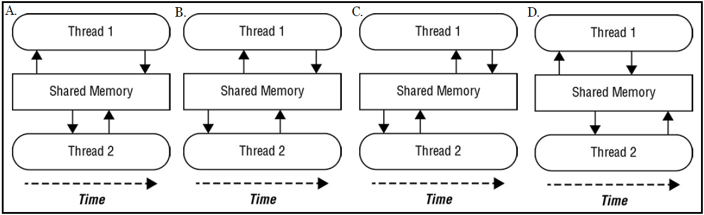

# <a name="Home"></a> Concurrency Quiz

## Содержание:
- [Обзор](#Overview)
- [1 : ExecutorService Submit and Execute](#ex1)
- [2 : Increment and Atomic](#ex2)
- [3 : Recommended way to define an asynchronous task](#ex3)
- [4 : ExecutorService methods](#ex4)
- [5 : Throwing of ConcurrentModificationException](#ex5)
- [6 : Livelock and resource starvation](#ex6)
- [7 : Future and Exceptions](#ex7)
- [8 : Executors class static methods](#ex8)
- [9 : SingleThreadExecutor and CyclicBarrier](#ex9)
- [10 : BlockingDeque methods with waiting](#ex10)
- [11 : Parralel and serial stream execution](#ex11)
- [12 : How to get parallel stream](#ex12)
- [13 : RecursiveTask and RecursiveAction](#ex13)
- [14 : An accumulator in a serial or parallel reduction](#ex14)
- [15 : Callable as a task](#ex15)
- [16 : Threads synchronization](#ex16)
- [17 : invokeAll() and invokeAny()](#ex17)
- [18 : Sorted concurrent collections](#ex18)
- [19 : Deadlock example with a bug](#ex19)
- [20 : ScheduledExecutorService methods](#ex20)
- [21 : thread-safe variable and ExecutorService shutdown](#ex21)
- [22 : Race condition](#ex22)
- [23 : RecursiveAction state variable](#ex23)
- [24 : Parallel Stream](#ex24)
- [25 : Stream and groupingByConcurrent](#ex25)
- [26 : Stream reduce](#ex26)
- [27 : Future get example](#ex27)
- [28 : Is it thread-safe?](#ex28)
- [29 : AtomicInteger decrement and increment](#ex29)
- [30 : CyclicBarrier triggering](#ex30)
- [31 : ThreadPool deadlock and shutdown](#ex31)
- [32 : Blocking methods in parallel stream](#ex32)
- [33 : Infinite loop at runtime](#ex33)
- [34 : concurrent reduction using the collect()](#ex34)
- [35 : ForkJoin pool uses](#ex35)
- [36 : ExecutorService shutdown](#ex36)
- [37 : ForEachOrdered for parralelStream](#ex37)
- [38 : Static and instance synchronization](#ex38)
- [39 : Thread-safe style: start and run methods](#ex39)
- [40 : Common mistakes](#ex40)

## [↑](#Home) <a name="Overview"></a> Overview
Далее будут рассмотрены примеры из OCP Java SE Programmer.
Испльзованы материалы из "OCA/OCP Java SE 8 Programmer Practice Tests".
Для проверки кода можно использовать [Java Online Compiler](https://www.tutorialspoint.com/compile_java_online.php).

## [↑](#Home) <a name="ex1"></a> 1 : ExecutorService Submit and Execute
>Which of the following methods is not available on an ExecutorService instance?
A. execute(Callable)
B. execute(Runnable)
C. submit(Callable)
D. submit(Runnable)

**Правильный ответ:** A
ExecutorService – интерфейс, расширяющий возможности интерфейса Executor. Интерфейс Executor создан в первую очередь для того, чтобы разделить запуск задачи от механики её выполнения (т.е. того, как будет создаваться поток, когда, как будет передана ему задача и т.п.). Самый простой способ думать об Executor’е как о ком-то, кто создаст поток и запихнёт в него задачу. Как мы помним, единственный способ для этого – new Thread(Runnable). Поэтому, и метод будет execute(Runnable). Этот метод ничего не возвращает. И это не совсем удобно. Мы даже не можем понять, что с нашей задачей в итоге: успех, не успех. Поэтому, было решено расширить Executor до ExecutorService. То есть интерфейс, который будет описывать кого-то, кто предоставит дополнительные сервисы. К этим дополнительным сервисам, в том числе, относятся методы submit в трех вариантах: Принимает Callable, принимает только Runnable, принимает Runnable и результат, который вернётся в случае успеха. Соответственно, submit возвращает Future (интерфейс, описывающий результат, результат которого выполнится когда-то в будущем). Это позволило получить возможность отслеживать статус и управлять задачами (отменять их, например).
Поэтому, правильный вариант A. Нет такого метода.

## [↑](#Home) <a name="ex2"></a> 2 : Increment and Atomic
```java
/*
2. Which statements about executing the following TicketTaker
application multiple times are true?
*/
import java.util.concurrent.atomic.*;
import java.util.stream.*;

public class TicketTaker {
    long ticketsSold;
    final AtomicInteger ticketsTaken;

    public TicketTaker() {
        ticketsSold = 0;
        ticketsTaken = new AtomicInteger(0);
    }

    public void performJob() {
        IntStream.iterate(1, p -> p+1)
            .parallel()
            .limit(10)
            .forEach(i -> ticketsTaken.getAndIncrement());
        IntStream.iterate(1, q -> q+1)
            .limit(5)
            .parallel()
            .forEach(i -> ++ticketsSold);
        System.out.print(ticketsTaken+" "+ticketsSold);
    }

    public static void main(String[] matinee) {
        new TicketTaker().performJob();
    }
}
```
I. The class compiles and runs without throwing an exception.
II. The first number printed is consistently 10.
III. The second number printed is consistently 5.
A. I only
B. I and II
C. I, II, and III
D. None of the above

**Правильный ответ:** B
Во-первых, ошибок в коде нет и он запустится без ошибок компиляции.
Как видно, используется многопоточное выполнение (т.к. используется parallel).
Первое выражение используется AtomicInteger, работа с которым thread-safe. Поэтому, первое вычисление всегда будет 10.
Второе выражение используется pre-increment оператор (++). Данный оператор не атомарные и не потокобезопасный поэтому (не thread-safe).
Существует возможность, когда два потока будут одновременно обновлять значение в одно и тоже время. Тогда, значение может быть меньше 5. Поэтому, третье утверждение ложно, тогда как первые два - правда.
Проверить можно изменим метод main:
```java
for (int i = 0; i < 30; i++) {
	new TicketTaker().performJob();
	System.out.println();
}
```
Рано или поздно, вторым выведется число, которое будет меньше, чем число 5.

## [↑](#Home) <a name="ex3"></a> 3 : Recommended way to define an asynchronous task
> Which of the following is a recommended way to define an asynchronous task?
A. Create a Callable expression and pass it to an instance of
Executors.
B. Create a class that extends Thread and overrides the start()
method.
C. Create a Runnable expression and pass it to a Thread constructor.
D. All of the above

**Правильный ответ:** C
++Вариант A++ неправильный: Executor не предназначен для выполнения Callable (т.к. интерфейс [Executor](https://docs.oracle.com/javase/7/docs/api/java/util/concurrent/Executor.html) принимает Runnable). Данный вариант был бы правильным, только если Executor заменить на ExecutorService, т.к. тогда нам станут доступны методы submit.
++Вариант B++ неправильный. Он бы был правильным, если заменить **start** на **run**, т.к. именно его рекомендуется переопределять. Это связано с тем, что метод **start** содержит дополнительную логику, такую как работу с группами (добавление потока в группу), обработка ошибок.
++Вариант C++ правильный. Это является одним из основных способов определения задачи, выполняемой асинхронно (т.е. в другом потоке, независимо от текущего).
++Вариант D++ неправильный, т.к. неверные варианты A и B.

## [↑](#Home) <a name="ex4"></a> 4 : ExecutorService methods
> Let’s say you needed a thread executor to create tasks for a
CyclicBarrier that has a barrier limit of five threads. Which static
method in ExecutorService should you use to obtain it?
A. newSingleThreadExecutor()
B. newSingleThreadScheduledExecutor()
C. newCachedThreadPool()
D. None of these would work.

**Правильный вариант:** D
Вопрос с подвохом. Чтобы получить instance of a thread executor мы должны испльзовать класс [Executors](https://docs.oracle.com/javase/7/docs/api/java/util/concurrent/Executors.html), а не ExecutorService. Поэтому, правильный вариант D.
Но если бы нас спросили про Executors, то правильным был бы вариант C.
++Вариант A++ неправильный, т.к. не разрешает конкурентую обработку. Внутри **singleThreadExecutor** лежит **LinkedBlockingQueue** размера **Integer.MAX_VALUE**. В данную очередь будут складываться все задачи и выполняться по одной в одном единственном потоке (отсюда и название singleThreadExecutor).
++Вариант B++ тоже неправильный, т.к. тоже не разрешает конкурентную обработку. Отличается от варианта A тем, что добавляет методы schedule при работе через интерфейс **ScheduledExecutorService**.
++Вариант C++ мог бы подойти, если бы спрашивали без подвоха. **newCachedThreadPool** внутри скрывает **SynchronousQueue**. Особенность этой очереди заключается в том, что поток, который добавляет в эту очередь данные блокируется, пока не появится поток, который данные заберёт.
Ну и не стоит забывать, что потоки, созданные через newCachedThreadPool "умрут" только через 60 секунд. То есть программа завершится, когда все потоки будут убиты по таймауту, т.к. будут idle.

## [↑](#Home) <a name="ex5"></a> 5 : Throwing of ConcurrentModificationException
```java
/*
5. Given the original array, how many of the following for statements
result in an exception at runtime, assuming each is executed
independently?
*/
import java.util.*;
import java.util.concurrent.ConcurrentLinkedQueue;
import java.util.concurrent.CopyOnWriteArrayList;

public class TicketTaker {
    List<Integer> original = new ArrayList<>
            (Arrays.asList(1, 2, 3, 4, 5));
    List<Integer> copy1 = new CopyOnWriteArrayList<>(original);
    for (Integer w : copy1)
        copy1.remove(w);
    List<Integer> copy2 = Collections.synchronizedList(original);
    for (Integer w : copy2)
        copy2.remove(w);
    List<Integer> copy3 = new ArrayList<>(original);
    for (Integer w : copy3)
        copy3.remove(w);
    Queue<Integer> copy4 = new ConcurrentLinkedQueue<>(original);
    for (Integer w : copy4)
        copy4.remove(w);
}
```
Варианты:
- A. Zero
- B. One
- C. Two
- D. Three

**Правильный вариант:** C
**CopyOnWriteArrayList** создаёт копию каждый раз, когда происходит модификация. Поэтому, в цикле не будет Runtime Exception.
**ConcurrentLinkedQueue** так же не бросает Runtime Exception. Это связано с тем, что порядок чтения/записи консистентен для всех потоков. Поэтому, нет счётчика модификаций **modcount**. Поэтому, при итерировании по коллекции и выполнении remove не будет брошено исключение и всё будет выполнено корректно.
Циклы для copy2 и copy3 обра бросят **ConcurrentModificationException**. В начале цикла for-each будет создан итератор, который запомнит количество модификаций. Т.к. в цикле выполняется remove не через итератор, то для итератора это внешнее вмешательство, счётчик не совпадёт и будет брошено исключение.
Таким образом, из 4 примеров два отработают с ошибкой, а два - нет.

## [↑](#Home) <a name="ex6"></a> 6 : Livelock and resource starvation
> Fill in the blanks: __________ is a special case of __________, in
which two or more active threads try to acquire the same set of locks
and are repeatedly unsuccessful.
A. Deadlock, livelock
B. Deadlock, resource starvation
C. Livelock, resource starvation
D. Resource starvation, race conditions

**Правильный вариант:** C
Resource starvation - "голодание", при котором активный поток периодически не может получить доступ к разделяемому ресурсу.
Livelock - это разновидность "ресурсного голодания". При livelock два или более активных потоков не могут получить доступ к разделяемому ресурсу, повторяя процесс снова и снова.
Livelock отличается от deadlock тем, что потоки активны, а не застревает в вечном ожидании.
Race condition - состояние гонки, когда две задачи выполняются в одно и тоже время, хотя должны выполняться последовательно.

## [↑](#Home) <a name="ex7"></a> 7 : Future and Exceptions
```java
//What is the output of the following application?
import java.util.concurrent.*;

public class TpsReport {
    public void submitReports() {
        ExecutorService service = Executors.newCachedThreadPool();
        Future bosses = service.submit(() -> System.out.print(""));
        service.shutdown();
        System.out.print(bosses.get());
    }

    public static void main(String[] memo) {
        new TpsReport().submitReports();
    }
}
```
Варианты ответа:
- A. null
- B. The code does not compile.
- C. Line 7 throws an exception at runtime.
- D. Line 8 throws an exception at runtime.

**Правильный вариант:** B
Данный код не скомпилируется на строке: bosses.get().
Как мы видим, **bosses** это [Future](https://docs.oracle.com/javase/7/docs/api/java/util/concurrent/Future.html). Future как бы предоставляет интерфейс для того, чтобы подсмотреть, как там выполняется задача. Само название показывает, что это что-то про то, что будет выполнено в будущем. Метод **get** возвращает результат. Соответственно, что делать данному потоку, если мы хотим в определённом месте получить данные откуда-то, где эти данные ещё не подготовили? Правильно, мы начинаем ждать. А коли наш поток останавливается, то мы становится похожи на тот же sleep и должны обработать исключения. Нас могут прервать, поэтому мы должны обработать **InterruptedException**. Так же что-то может пойти не так, поэтому мы должны обработать так же и **ExecutionException**.
Если устранить эту ошибку, то будет выведено: **null**. Что логично, т.к. был выполнен submit для Runnable, а он не возвращает результат и дефолтный результат не указан.

## [↑](#Home) <a name="ex8"></a> 8 : Executors class static methods
> Which of the following static methods does not exist in the Executors class?
A. newFixedScheduledThreadPool()
B. newFixedThreadPool()
C. newSingleThreadExecutor()
D. newSingleThreadScheduledExecutor()

**Правильный вариант:** A
Класс [Executors](https://docs.oracle.com/javase/7/docs/api/java/util/concurrent/Executors.html) предоставляет различные статические методы.
Варианты B и C являются корректными способами получения экземпляра ExecutorService.
Стоит помнить, что newSingleThreadExecutor равносильно вызову newFixedThreadPool со значением 1.
Вариант D корректный способ получить single-thread экземпляр ScheduledExecutorService.
А вот варианта А (newFixedScheduledThreadPool) не существует, есть только newScheduledThreadPool.

## [↑](#Home) <a name="ex9"></a> 9 : SingleThreadExecutor and CyclicBarrier
```java
//How many times does the following application print Ready at runtime?
import java.util.concurrent.*;

public class CartoonCat {
    private void await(CyclicBarrier c) {
        try {
            c.await();
        } catch (Exception e) {}
    }

    public void march(CyclicBarrier c) {
        ExecutorService s = Executors.newSingleThreadExecutor();
        for(int i=0; i<12; i++)
            s.execute(() -> await(c));
        s.shutdown();
    }

    public static void main(String... strings) {
        new CartoonCat().march(new CyclicBarrier(4,
        () -> System.out.println("Ready")));
    }
}
```
Варианты ответов:
- A. Zero
- B. One
- C. Three
- D. The code does not compile.

**Правильный вариант:** A
Казалось бы, много букв, но если разобраться, то всё просто.
Рассмотрим метод main.
Мы создаём новый [CyclicBarrier](https://docs.oracle.com/javase/7/docs/api/java/util/concurrent/CyclicBarrier.html), который будет срабатывать, когда у барьера будет 4 потока. Как только он будет срабатывать, мы хотим напечатать Ready.
Создаём новый CartoonCat и вызываем метод march с переданным туда барьером.
Далее мы создаём ExecutorService при помощи статического метода newSingleThreadExecutor. Далее, в цикле отдаём команду executor'у выполнить команду, которая вызывает метод ожидания у барьера.
Стоп-стоп-стоп. newSingleThreadExecutor? Да, внутри него пул всего в 1 поток и огромная LinkedBlockingQueue в Integer.MAX_VALUE, куда будут складываться все задачи.
Получается, что первый же поток будет ждать у барьера остальные 3 потока, но т.к. у нас single thread executor, то других потоков то и не будет.
Следовательно, не будет ничего напечатано, мы будем ждать до бесконечности. Вот и всё.
Если бы мы использовали ```Executors.newCachedThreadPool()```, тогда бы вывелось 3 раза и был бы правильным вариант C.

## [↑](#Home) <a name="ex10"></a> 10 : BlockingDeque methods with waiting
> Which thread-safe **class** would you use to add elements to the front
and back of an ordered data structure and includes methods for
waiting a specified amount of time to do so?
A. BlockingDeque
B. ConcurrentLinkedDeque
C. ConcurrentSkipListSet
D. LinkedBlockingDeque

**Правильный вариант:** D
Во-первых, [BlockingDeque](https://docs.oracle.com/javase/7/docs/api/java/util/concurrent/BlockingDeque.html) это интерфейс, а не класс. Описывает блокируемую двунаправленную очередь, в которую можно добавлять как в конец, так и в начало. А вот реализация - **LinkedBlockingDeque**. Предоставляет методы offer и poll, для которых можно указать таймаут. Поэтому, это правильный вариант ответа.
Остальные два варианта неправильные:
- **ConcurrentLinkedDeque** - является двусторонней очередью, но не имеет методов с ожиданием определённого времени на добавление и получение с начала и с конца очереди.
- **ConcurrentSkipListSet** - элементы сортированы и упорядочены, не содержит ни одного блокирующего метода + не поддерживает добавление в начало, а добавляет в то место Set, куда элемент попадёт после сортировки и упорядочивания.

## [↑](#Home) <a name="ex11"></a> 11 : Parralel and serial stream execution
> Three of the four methods below always produce the same result
whether they are executed on a serial or parallel ordered stream.
Which one does not?
A. findAny()
B. findFirst()
C. limit()
D. skip()

**Правильный вариант:** A
Важно, что stream у нас [ordered](https://docs.oracle.com/javase/8/docs/api/java/util/stream/package-summary.html#Ordering).
Метод **findAny()** может вернуть любой элемент стрима. На serial стриме это будет первый элемент, в то время как на паралельном стриме результат не определён и вернётся любой элемент.
Когда применёются на ordered стримах остальные методы, результат будет одинаков как для паралельных, так и для последовательных стримов. Поэтому, эти операции могут быть довольно быть затратны для параллельного вычисления, т.к. процесс вынуждено будет превращен в последовательное вычисление.

## [↑](#Home) <a name="ex12"></a> 12 : How to get parallel stream
```java
//What is the result of executing the following application multiple times?
import java.util.*;
    public class Bounce {
        public static void main(String... legend) {
            Arrays.asList(1,2,3,4).stream()
                .forEach(System.out::println);
            Arrays.asList(1,2,3,4).parallel()
                .forEachOrdered(System.out::println);
        }
}
```
Варианты ответа:
- A. Only the first array is printed in the same order every time.
- B. Only the second array is printed in the same order every time.
- C. Both arrays are printed in the same order every time.
- D. None of the above

**Правильный ответ:** D
Как мы видим, мы получаем список при помощи Array.asList().
Интерфейс List наследуется от Collection интерфейса. Тот, в свою очередь, предоставляет два метода для получения стримов: stream() и parallelStream().
Метод parallel() является уже операцией над стримом.
Данный пример дан с ошибкой, поэтому не напечатается ничего.
Если мы поправим, то получим на печатать сначала первый стрим (он ordered, т.к. получен из List). А затем выполняем парареллельные вычисления, выводя значения. Но мы указали forEachOrdered(), что приведёт к выполнению в последовательном режиме.

## [↑](#Home) <a name="ex13"></a> 13 : RecursiveTask and RecursiveAction
> Fill in the blanks: In the fork/join framework, using the
__________ class requires overriding an abstract compute() method
containing a generic return type, while using the __________ class
requires overriding an abstract compute() method containing a void
return type.
A. ForkJoinTask, RecursiveAction
B. RecursiveAction, RecursiveTask
C. RecursiveTask, ForkJoinTask
D. RecursiveTask, RecursiveAction

**Правильный ответ:** D
Так называемый fork/join framework использует ForkJoinPool, который в свою очередь использует ForkJoinTask. ForkJoinTask является родительским классом для RecursiveAction и RecursiveTask. Он является более легковесной формой Future, как сказано в JavaDoc. Поэтому, метод compute() ("вычислить") остуствует у ForkJoinTask.
Поэтому, варианты A и C неправильные.
RecursiveTask похож на Callable, возвращает результат. Поэтому он "utilizes a generic return type", в то время как RecursiveAction похож на Runnable, т.е. не возвращает результат, а просто выполняет какое-то действие. Поэтому, логично, что он возвращает void.
Поэтому, правильным вариантом является D.

## [↑](#Home) <a name="ex14"></a> 14 : An accumulator in a serial or parallel reduction
```java
/*
Given the following code snippet, which lambda expression is the best
choice for the accumulator, based on the rules for applying a parallel
reduction?
*/
import java.util.function.BiFunction;

public class GoodAccumulator {
    int i;
    public void test() {
        BiFunction<Integer,Integer,Integer> accumulator =
            _________________;
        System.out.print(Arrays.asList(1,2,3,4,5)
                .parallelStream()
                .reduce(0,accumulator,(s1, s2) -> s1 + s2));
    }
}
```
Варианты ответов:
- A. (a,b) -> (a-b)
- B. (a,b) -> 5
- C. (a,b) -> i++
- D. None of the above are appropriate.

**Правильный ответ:** B
>An accumulator in a serial or parallel reduction must be associative
and stateless. In a parallel reduction, invalid accumulators tend to
produce more visible errors, where the result may be processed in an
unexpected order. Option A is not associative, since (a-b)-c is not the
same as a-(b-c) for all values a, b, and c. For example, using values of
1, 2, and 3 results in two different values, -4 and 2. Option C is not
stateless, since a class or instance variable i is modified each time the
accumulator runs. That leaves us with Option B, which is the correct
answer since it is both stateless and associative. Even though it
ignores the input parameters, it meets the qualifications for
performing a reduction

## [↑](#Home) <a name="ex15"></a> 15 : Callable as a task
What is the output of the following code snippet?
```java
Callable c = new Callable() {
	public Object run() {return 10;}
};
ExecutorService s = Executors.newScheduledThreadPool(1);
for (int i=0; i < 10; i++) {
	Future f = s.submit(c);
	f.get();
}
s.shutdown();
System.out.print("Done!");
```

Варианты ответов:
- A. Done!
- B. The code does not compile.
- C. The code hangs indefinitely at runtime.
- D. The code throws an exception at runtime.

**Правильный ответ:** B
Данный код не скомпилируется, т.к. Callable должнен определить метод call, а не метод run (этот метод должен определять Runnable). Поэтому, вариант B является верным.
Если бы ошибки не было, тогда бы данный код напечатал Done!.

## [↑](#Home) <a name="ex16"></a> 16 : Threads synchronization
> The following diagrams represent the order of read/write operations
of two threads sharing a common variable. Each thread first reads the
value of the variable from memory and then writes a new value of the
variable back to memory. Which diagram demonstrates proper
synchronization?


**Правильный вариант:** C
Частью синхронизированного доступа к переменной является проверока того, что операции чтения/записи атомарны или происходят без прерывания.
Например, инкрементация требует чтения значения и затем немедленную запись нового значения. Если любой другой поток остановит этот процесс, тогда данные могут быть потеряны. В соответствии с этим, вариант C отображает правильный синхронизированный доступ.
Поток 2 читает значение и затем записывает его без прерываний. Поток 1 зачем считывает новое значение и записывает его.
Остальные варианты ошибочны потому, что один поток пишет в переменную между тем, как другой поток читает и пишет в переменную.
>Because a thread is writing data to a variable that has already been
written to by another thread, it may set invalid data. For example, two
increment operations running at the same time could result in one of
the increment operations being lost.

## [↑](#Home) <a name="ex17"></a> 17 : invokeAll() and invokeAny()
```java
//What is the output of the following application?
import java.util.*;
import java.util.concurrent.*;

public class Race {
    static ExecutorService service = Executors.newFixedThreadPool(8);

    public static int sleep() {
        try {
            Thread.sleep(1000);
        } catch (Exception e) {}
        return 1;
    }

    public static void hare() {
        try {
            Callable c = () -> sleep();
            final Collection<Callable<Integer>> r =
            Arrays.asList(c,c,c);
            List<Future<Integer>> results = service.invokeAll(r);
            System.out.println("Hare won the race!");
        } catch (Exception e) {e.printStackTrace();}
    }

    public static void tortoise() {
        try {
            Callable c = () -> sleep();
            final Collection<Callable<Integer>> r =
            Arrays.asList(c,c,c);
            Integer result = service.invokeAny(r);
            System.out.println("Tortoise won the race!");
        } catch (Exception e) {e.printStackTrace();}
    }

    public static void main(String[] p) throws Exception {
        service.execute(() -> hare());
        service.execute(() -> tortoise());
    }
}
```
Варианты ответа:
- A. Hare won the race! is printed first.
- B. Tortoise won the race! is printed first.
- C. The code does not compile.
- D. The result is unknown until runtime.

**Правильный ответ:** D
Код скомпилируется и запустится без проблем.
Методы hare() и turtoise() одинаковы, за исключением того, что один вызывает **invokeAll()**, а другой вызывает **invokeAny()**.
Важно знать, что оба метода выполняются синхронно, ожидая результата одной или более задач.
Вызывая invokeAll() метод приводит к ожиданию текущего потока пока не выполнятся все задачи. Т.к. каждая задача длится 1 секунду и они выполняются парарллельно, метод hare() займёт примерно 1 секунду.
Вызывая invokeAny() метод приводит к ожиданию текущего потока пока не выполнится хотя бы одна задача. Хотя часто возвращается результат первой выполенной задачи, но это не гарантируется. Т.к. задача длится 1 секунду, то метод будет выполнятся тоже 1 секунду.
Т.к. оба метода выполняются примерно одинаковое кол-во времени, то любой может выполнится первым. Поэтому, вариант D является правильным.
Стоит помнить, что после того, как программа выполнится, она не завершит своё выполнение, т.к. ExecutorService не прекращает работу (не выполнен shutdown).

## [↑](#Home) <a name="ex18"></a> 18 : Sorted concurrent collections
> Which of the following concurrent collections is sorted?
A. ConcurrentLinkedQueue
B. ConcurrentSkipListMap
C. CopyOnWriteArrayList
D. LinkedBlockingQueue

**Правильный вариант:** B
Про skiplist есть отличная статья "[Еще раз про skiplist…](https://habrahabr.ru/post/139870/)". А обзор concurrent можно посмотреть в статье "[Обзор java.util.concurrent.*](https://habrahabr.ru/company/luxoft/blog/157273/)". Если кратко, то:
> ConcurrentSkipListMap<K, V>   — Является аналогом TreeMap с поддержкой многопоточности. Данные также сортируются по ключу и гарантируется усредненная производительность log(N) для containsKey, get, put, remove и других похожих операций.

Получается, **ConcurrentSkipListMap** отсортирован. Остальные коллекции тоже ordered, т.е. упорядоченные, но не сортированные.
Рекомендуется запомнить, что если в имени класса указано SkipList, это означает, что оно отсортировано как Sorted Set или Map.

## [↑](#Home) <a name="ex19"></a> 19 : Deadlock example with a bug
```java
//What is the most likely result of executing the following application?
import java.util.concurrent.*;

public class Riddle {
    public void sleep() {
        try {
            Thread.sleep(5000);
        } catch (Exception e) {}
    }

    public String getQuestion(Riddle r) {
        synchronized {
            sleep();
            if(r != null) r.getAnswer(null);
            return "How many programmers does it take "
                + "to change a light bulb?";
        }
    }

    public synchronized String getAnswer(Riddle r) {
        sleep();
        if(r != null) r.getAnswer(null);
        return "None, that's a hardware problem";
    }

    public static void main(String... ununused) {
        final Riddle r1 = new Riddle();
        final Riddle r2 = new Riddle();
        ExecutorService s = Executors.newFixedThreadPool(2);
        s.submit(() -> r1.getQuestion(r2));
        s.execute(() -> r2.getAnswer(r1));
        s.shutdown();
    }
}
```
Варианты ответа:
- A. A deadlock is produced at runtime.
- B. A livelock is produced at runtime.
- C. The application completes successfully.
- D. The code does not compile.

**Правильный ответ:** D
К сожалению, данный код не скомпилируется. Как мы видим, в методе getQuestion используется ключевое слово synchronized. Однако, не указан объект, для которого будет захвачен монитор. Это необходимое условие, без этого код не скомпилируется.
А что же будет, если исправить данную ошибку?
Каждая задача получит соответствующий лок, затем подождёт несколько секунд, затем будет ожидать лок на другой объект. Т.к. лок уже взят, оба будут ждать неопределённое время, т.е. случится deadlock.

## [↑](#Home) <a name="ex20"></a> 20 : ScheduledExecutorService methods
> Which ScheduledExecutorService method can result in the same
action being executed by two threads at the same time?
A. scheduleAtFixedDelay()
B. scheduleAtFixedRate()
C. scheduleWithFixedDelay()
D. There is no such method in ScheduledExecutorService.

**Правильный ответ:** B
Во-первых, **ScheduledExecutorService** не имеет метода scheduleAtFixedDelay (он называется scheduleWithFixedDelay), поэтому вариант А уже неправильный.
Метод **scheduleAtFixedRate()** создаёт новую задачу в указанном временном промежутке, даже если предыдущая задача для того же действия ещё активна.
Поэтому, возможно выполнение в нескольких потоках одной и той же задачи в одной и тоже время. Поэтому, вариант B правильный.
Метод **scheduleWithFixedDelay()** ожидает завершения предыдущей задачи (именно от неё выполняется отсчёт).

## [↑](#Home) <a name="ex21"></a> 21 : thread-safe variable and ExecutorService shutdown
```java
// What is the output of the following application?
import java.util.concurrent.*;

public class Athlete {
    int stroke = 0;
    public synchronized void swimming() {
        stroke++;
    }
    public static void main(String... laps) {
        ExecutorService s = Executors.newFixedThreadPool(10);
        Athlete a = new Athlete();
        for(int i=0; i<1000; i++) {
            s.execute(() -> a.swimming());
        }
        s.shutdown();
        System.out.print(a.stroke);
    }
}
```
Варианты ответа:
- A. 1000
- B. The code does not compile.
- C. The result is unknown until runtime because stroke is not
accessed in a thread-safe manner and a write may be lost.
- D. The result is unknown until runtime for some other reason.

**Правильный ответ:** D
Данный код успешно компилируется.
Все записи синхронизированы, поэтому переменная stroke является thread-safe.
Однако чтение осуществляется в тот момент, когда задачи ещё могут выполняться.
Если вместо shutdown написать awaitTermination, тогда текущий поток дождётся завершения остальных потоков и затем напечает 1000.

## [↑](#Home) <a name="ex22"></a> 22 : Race condition
> Which of the following is most likely to be caused by a race condition?
A. A thread perpetually denied access to a resource
B. An int variable incorrectly reporting the number of times an
operation was performed
C. Two threads actively trying to restart a blocked process that is
guaranteed to always end the same way
D. Two threads endlessly waiting on each other to release shared
locks

**Правильный ответ:** B
Race condition или состояние гонки - это нежелательный результат, когда две задачи выполняются в одно и тоже время, а должны выполняться последовательно. Результатом становятся некорректные данные.
Если два потока оба изменяют одно и тоже int поле и нет синхронизации, тогда одна из записей может быть потеряна. Поэтому, вариант B является правильным.
Вариант A является описанием Resource Starvation.
Варианты C и D описывают livelock и deadlock.

## [↑](#Home) <a name="ex23"></a> 23 : RecursiveAction state variable
```java
//What is the output of the following application?
import java.util.concurrent.*;

public class CountSheep extends RecursiveAction {
    static int[] sheep = new int[] {1,2,3,4};
    final int start;
    final int end;
    int count = 0;

    public CountSheep(int start, int end) {
        this.start = start;
        this.end = end;
    }

    public void compute() {
        if(end-start<2) {
            count += sheep[start];
            return;
        } else {
            int middle = start + (end-start)/2;
            invokeAll(new CountSheep(start,middle),
            new CountSheep(middle,end));
        }
    }

    public static void main(String[] night) {
        ForkJoinPool pool = new ForkJoinPool();
        CountSheep action = new CountSheep(0,sheep.length);
        pool.invoke(action);
        pool.shutdown();
        System.out.print(action.count);
    }
}
```
Варианты ответов:
- A. 0
- B. 10
- C. The code does not compile.
- D. None of the above.

**Правильный вариант:** A
Данный код скомпилируется без ошибок.
Приложение пытается сосчитать элементы массива рекурсивно.
Как и положено при работе с ForkJoinPool написан класс CountSheep, который является наследником RecursiveAction, т.е. он не возвращает результат. Соответственно, мы обязаны определить метод compute.
Рекурсивно вместо одного действия будут создаваться ещё 2 действия, которые будут делить обрабатываемые участки массива пополам. А когда участок будет меньше двух, то в переменную count предполагается суммировать значение элемента массива.
Всё бы было хорошо, если бы не ошибка в этой программе. У переменной count забыли указать static у счётчика. Т.к. после деления будут созданы новые задачи, то счётчик будет менять значение уже в совсем других instance, а метод main запросит значение у изначального instance и получит 0.
Чтобы исправить это - необходимо добавить ключевое слово static для поля count. Тогда будет напечатано 10.

## [↑](#Home) <a name="ex24"></a> 24 : Parallel Stream
>Which statement about parallel streams is correct?
A. A parallel stream always executes all stream operations faster than
a serial stream.
B. A parallel stream always executes certain stream operations faster
than a serial stream.
C. A parallel stream synchronizes its operations so that they are
atomic.
D. All streams can be converted to a parallel stream.

**Правильный ответ:**  D
Прежде всего, определённые операции над стримами, такие как limit() or skip() заставляют принудитльно паралельный стрим вести себя как последовательный.
По этой причине, вариант А неверный.
Некоторые операции в паралельных стримах могут быть выполнены быстрее, но нет никаких гарантий на этот счёт. Поэтому, вариант B тоже неверный.
Вариант C неверный, потому что выполняемые действия не синхронизированы и вся ответственность за это возлагается на разработчика.
Наконец, вариант D является верным. Все стримы наследуют интерфейс BaseStream, который позволяет при помощи метода parallel() сделать из обычного стрима паралельный.

## [↑](#Home) <a name="ex25"></a> 25 : Stream and groupingByConcurrent
```java
// What is a possible output of the following application?
import java.util.*;
import java.util.concurrent.*;
import java.util.stream.*;

public class Car {
    private String model;
    private int year;

    public Car(String name, int year) {
        this.model = name; this.year = year;
    }

    public int getYear() {
        return year;
    }

    @Override
    public String toString() {
        return model;
    }

    public static void main(String... make) {
        List<Car> cars = new ArrayList<>();
        cars.add(new Car("Mustang",1967));
        cars.add(new Car("Thunderbird",1967));
        cars.add(new Car("Escort",1975));
        ConcurrentMap<Integer, List<Car>> map = cars
            .stream()
            .collect(Collectors.groupingByConcurrent(Car::getYear));
        System.out.print(map);
    }
}
```
Варианты ответа:
- A. {1975=[Escort], 1967=[Thunderbird, Mustang]}
- B. {Escort=[1975], Thunderbird=[1967], Mustang=[1967]}
- C. The code does not compile.
- D. The application throws an exception at runtime because the
stream is not parallel.

**Правильный ответ:** A
Код скомпилируется и запустится без ошибок.
Не смотря на то, что выполняется groupingByConcurrent в непаралельном стриме, это не приводит к возникновению ошибки. Однако, страдает производительность. Но результат будет вычислен корректно.
Карта, как мы видим, с ключём по Integer. Следовательно, первый в любом случае будет число. К тому же выполнена группировка в List, а для 1967 у нас несколько значений.
Поэтому, вариант А является правильным.

## [↑](#Home) <a name="ex26"></a> 26 : Stream reduce
```java
//What is the output of the following application?
import java.util.*;

public class Concat {
    public String concat1(List<String> values) {
        return values.parallelStream()
            .reduce("a",(x,y)->x+y,String::concat);
    }

    public String concat2(List<String> values) {
        return values.parallelStream()
            .reduce((w,z)->z+w).get();
    }

    public static void main(String... questions) {
        Concat c = new Concat();
        List<String> list = Arrays.asList("Cat","Hat");
        String x = c.concat1(list);
        String y = c.concat2(list);
        System.out.print(x+" "+y);
    }
}
```
Варианты ответа:
- A. aCataHat HatCat
- B. CatHat CatHat
- C. The code does not compile because concat1() returns an Optional.
- D. The code does not compile for a different reason.

**Правильный ответ:** A
Код скомпилируется без ошибок.
> The code compiles and runs without issue. The three-argument
reduce() method returns a generic type, while the one-argument
reduce() method returns an Optional. The concat1() method is passed
an identity "a", which it applies to each element, resulting in the
reduction to aCataHat. The lambda expression in the concat2()
method reverses the order of its inputs, leading to a value of HatCat.
Therefore, Option A is the correct answer.

## [↑](#Home) <a name="ex27"></a> 27 : Future get example
```java
//What is the output of the following application?
import java.util.concurrent.*;

public class Accountant {
    public static void completePaperwork() {
        System.out.print("[Filing]");
    }
    public static double getPi() {
        return 3.14159;
    }

    public static void main(String[] args) throws Exception {
        ExecutorService x = Executors.newSingleThreadExecutor();
        Future<?> f1 = x.submit(() -> completePaperwork());
        Future<Object> f2 = x.submit(() -> getPi());
        System.out.print(f1.get()+" "+f2.get());
        x.shutdown();
    }
}
```
Варианты ответа:
- A. [Filing]null 3.14159
- B. The declaration of f1 does not compile.
- C. The declaration of f2 does not compile.
- D. An exception is thrown at runtime.

**Правильный ответ:** A
Код скомилируется без ошибок, поэтому ответы B и C неправильные.
Используется два Future: f1 и f2
f1 использует версию submit у ExecutorService, которая принимает Runnable и возвращает Future<?>. Сначала мы ожидаем f1.get (возвращает null). Затем мы получаем результат f2. null будет потому, что в System.out.print возвращается null, но при выполнении он печатает без перехода на новую строку [Filling]. Поэтому, правильный вариант А.

## [↑](#Home) <a name="ex28"></a> 28 : Is it thread-safe?
```java
//Which statement about the following class is correct?
import java.util.*;

public class ThreadSafeList {
    private List<Integer> data = new ArrayList<>();
    public synchronized void addValue(int value) {
        data.add(value);
    }
    public int getValue(int index) {
        return data.get(index);
    }
    public int size() {
        synchronized(ThreadSafeList.class) {
            return data.size();
        }
    }
}
```
Варианты ответа:
- A. The code does not compile because of the size() method.
- B. The code compiles and is thread-safe.
- C. The code compiles and is not thread-safe.
- D. The code does not compile for another reason.

**Правильный ответ:** С
Класс успешно компилируется, поэтому варианты A и D неверные.
Класс пытается создать синхронизированную версию List<Integer>.
Методы size() и addValue() помогают синхронизировать операции чтения/записи.
К сожалению, метод getValue() не синхронизирован, поэтому класс не thread-safe.
Есть возможность того, что один поток может добавлять значение в объект, пока другой поток читает из объекта, что приведёт к неожиданному результату.
Так же важно, что метод size синхронизируется по классу, что очень ощутимо скажется на производительности, т.к. все объекты будут синхронизироваться по одному объекту.

## [↑](#Home) <a name="ex29"></a> 29 : AtomicInteger decrement and increment
>Which two method names, when filled into the print2() method,
produce the same output as the print1() method? Assume the input
arguments for each represent the same non-null numeric value, only
accessible by a single thread at a time.
public static void print1(int value) {
	System.out.println(value--);
	System.out.println(++value);
}
public static void print2(AtomicInteger value) {
	System.out.println(value.__________);
	System.out.println(value.__________);
}

Варианты ответа:
- A. decrementAndGet() and getAndIncrement()
- B. decrementAndGet() and incrementAndGet()
- C. getAndDecrement() and getAndIncrement()
- D. getAndDecrement() and incrementAndGet()

**Правильный ответ:** D
> The post-decrement operator (––) decrements a value but returns
the original value. It is equivalent to the atomic getAndDecrement()
method. The pre-increment operator (++) increments a value and then
returns the new value. It is equivalent to the incrementAndGet()
atomic operation. For these reasons, Option D is the correct answer

## [↑](#Home) <a name="ex30"></a> 30 : CyclicBarrier triggering
```java
//ow many times does the following application print 1 at runtime?
import java.util.concurrent.*;
import java.util.stream.*;

public class Boat {
    private void waitTillFinished(CyclicBarrier c) {
        try {
            c.await();
            System.out.print("1");
        } catch (Exception e) {}
    }

    public void row(ExecutorService service) {
        final CyclicBarrier cb = new CyclicBarrier(5);
        IntStream.iterate(1, i -> i+1)
            .limit(12)
            .forEach(i -> service.submit(() -> waitTillFinished(cb)));
    }

    public static void main(String[] oars) {
        ExecutorService service = null;
        try {
            service = Executors.newCachedThreadPool();
            new Boat().row(service);
        } finally {
            service.isShutdown();
        }
    }
}
```
Варианты ответа:
- A. 0
- B. 10
- C. 12
- D. None of the above

**Правильный ответ:** B
Для CyclicBarrier выставлен барьер в 5 потоков.
При помощи IntStream будет отправлено 12 задач.
Соответственно, барьер сработает на 5 и на 10. На 15 уже не сработает (т.к. всего 12), поэтому он напечатает единицы только 10 раз.

## [↑](#Home) <a name="ex31"></a> 31 : ThreadPool deadlock and shutdown
> Using the Boat class from the previous question, what is the final state
of the application?
A. The application produces an exception at runtime.
B. The application terminates successfully.
C. The application hangs indefinitely because the ExecutorService is
never shut down.
D. The application produces a deadlock at runtime.

**Правильный ответ:** D
Приложение из последнего вопроса будет в состоянии Deadlock, потому что:
После срабатывания второй раз барьера 2 потока будут бесконечно ожидать ещё 3 потока, чтобы барьер сработал. Но у нас всего 12 потоков было, а не 15.
Так же стоит обратить внимание на то, что желательно выполнять shutdown для ExecutorService, т.к. сам он автоматически это делает не всегда и это зависит от того, какой экземпляр был создан.
Например, таймаут потока для CachedThreadPool равен минуте (нам повезло), а вот для FixedThreadPool таймаут отсутствует.

## [↑](#Home) <a name="ex32"></a> 32 : Blocking methods in parallel stream
```java
// 32. What is the expected output of the following application?
import java.util.concurrent.*;
import java.util.stream.*;

public class Line {
    static BlockingDeque<Integer> queue = new LinkedBlockingDeque<>();

    public static void main(String[] participants) throws Exception {
        IntStream.iterate(1, i -> i+1).limit(5)
            .parallel()
            .forEach(s ->
            queue.offerLast(s,10000,TimeUnit.MILLISECONDS));

        IntStream.iterate(1, i -> 5).limit(10)
            .parallel()
            .forEach(s -> queue.pollFirst(10,TimeUnit.SECONDS));
        System.out.print(queue.size());
    }
}
```
Варианты ответа:
- A. 0
- B. A number from 0 to 5
- C. The code does not compile.
- D. The code compiles but throws an exception at runtime.

**Правильный овтет:** C
Данный код не скомпилируется, т.к. блокирующие методы **offerLast()** и **pollFirst** каждый бросает проверяемое исключение InterruptedException, которые не обрабатываются лямбда выражением. Поэтому, правильный ответ - C
Если бы лямбда выражение было бы обёрнуто в try-catch блок, то сначала бы все элементы были бы добавлены в очередь, затем все элементы были бы удалены из очереди, и в результате было бы напечатано 0.

## [↑](#Home) <a name="ex33"></a> 33 : Infinite loop at runtime
> Given the original array, how many of the following for statements
result in an infinite loop at runtime, assuming each is executed
independently?
List<Integer> original = new ArrayList<>(Arrays.asList(1,2,3));
List<Integer> copy1 = new ArrayList<>(original);
for(Integer q : copy1)
copy1.add(1);
List<Integer> copy2 = new CopyOnWriteArrayList<>(original);
for(Integer q : copy2)
copy2.add(2);
Deque<Integer> copy3 = new ConcurrentLinkedDeque<>(original);
for(Integer q : copy3)
copy3.push(3);
List<Integer> copy4 = Collections.synchronizedList(original);
for(Integer q : copy4)
copy4.add(4);

Варианты ответа:
- A. Zero
- B. One
- C. Two
- D. Three

**Правильный ответ:** A
Во-первых, for loops для copy1 и copy4 оба бросят **ConcurrentModificationException**, т.к. оба не разрешают модификацию пока по ним итерируются.
**CopyOnWriteArrayList** создаёт новую копию каждый раз, когда он модифицируется. При этом, итератор (который используется в for-each loop) будет отновится к самому первому instance, т.е. к instance без изменений.
**ConcurrentLinkedDeque** в copy3 выполниться без исключений или бесконечных циклов. Конкурентная коллекция вводит порядок на чтение/запись, поэтому доступ к классу будет консистентным для всех потоков и обработчиков, даже итераторов. А так как при помощи метода **push()** мы вставляем элементы с головы очереди, то данные элементы не будут участвовать в итерациях и цикл завершится.
Если бы мы использовали **offer()**, элементы бы добавлялись в конец очереди "с хвоста", участвовали бы в итерации и мы бы получили бесконечный цикл.

## [↑](#Home) <a name="ex34"></a> 34 : concurrent reduction using the collect()
> Three of the four following options make up the requirements for
performing a parallel reduction with the collect() method, which
takes a Collector argument. Choose the one that is not a requirement.
A. The Collector argument is marked concurrent.
B. The elements of the stream implement the Comparable interface.
C. The stream is parallel.
D. The stream or Collector is marked unordered.

**Правильный ответ:** B
> Options A, C, and D are the precise requirements for Java to
perform a concurrent reduction using the collect() method, which
takes a Collector argument. Recall from your studies that a Collector
is considered concurrent and unordered if it has the
Collector.Characteristics enum values CONCURRENT and UNORDERED,
respectively. Option B is the correct answer because elements of a
stream are not required to implement Comparable in order to perform
a parallel reduction.

## [↑](#Home) <a name="ex35"></a> 35 : ForkJoin pool uses
```java
// Which statement about the following application is true?
import java.util.concurrent.*;

public class Fun extends RecursiveTask<Integer> {
    final int value;

    public Fun(int value) {
        this.value = value;
    }

    @Override protected Integer compute() { // w1
        if(value<1) {
            return 1;
        }
        final Fun f1 = new Fun(value-1);
        final Fun f2 = new Fun(value-2);
        return f1.compute() * f2.compute();
    }

    public static void main(String... data) {
        ForkJoinPool pool = new ForkJoinPool();
        try {
            System.out.print(pool.invoke(new Fun(10)));
        } finally {
            pool.shutdown();
        }
    }
}
```
Варианты ответа:
- A. The class does not compile due to line w1.
- B. The class does not compile for another reason.
- C. The application compiles and uses the fork/join framework
correctly.
- D. The application compiles but does not use the fork/join framework
correctly.

**Правильный ответ:** D
Класс компилируется и запускается без ошибок, поэтому варианты A и B неправильные.
Цель fork/join framework выполнить параллельно подзадачи в нескольких потоках.
К сожалению, вызывая compute() внутри существуещего метода compute() не создаётся новый поток. В результате задача будет выполнена в одном потоке, несмотря на то, что в пуле доступны потоки. Поэтому правильный вариант - D.
Чтобы правильный использовать Fork/join метод compute должен быть переписан. f1.compute() должен быть заменён на f1.fork() чтобы обрабатать данные в отдельном потоке. В return выражении f1.compute() необходимо заменить на f1.join(), чтобы пока f2.compute() выполнялось мы получали результат f1.
Пример можно посмотреть тут: [Fork/Join With Fibonacci and Karatsuba](https://www.javaspecialists.eu/archive/Issue201.html).

## [↑](#Home) <a name="ex36"></a> 36 : ExecutorService shutdown
> Which ExecutorService method guarantees all running tasks are
stopped in an orderly fashion?
A. shutdown()
B. shutdownNow()
C. halt()
D. None of the above

**Правильный ответ:** D
Метод **shutdown** не даёт выполняться новым задачам, но позволяет уже существующим задачам быть выполненными. Метод **shutdownNow** пытается завершить все запущенные задачи. Но ни один из этих методов не гарантирует, что задачи будут остановлены.
А метода **halt()** вообще нет.

## [↑](#Home) <a name="ex37"></a> 37 : ForEachOrdered for parralelStream
```java
/*
Given the following code snippet, what statement about the values
printed on lines p1 and p2 is correct?
*/
List<Integer> db = Collections.synchronizedList(new ArrayList<>());
IntStream.iterate(1, i -> i+1).limit(5)
	.parallel()
	.map(i -> {db.add(i); return i;})
	.forEachOrdered(System.out::print); // p1
System.out.println();
db.forEach(System.out::print); // p2
```
Варианты ответа:
- A. They are always the same.
- B. They are sometimes the same.
- C. They are never the same.
- D. The code will produce a ConcurrentModificationException at runtime.

**Правильный ответ:** B
Во-первых, используется синхронизированный список, который thread-safe (т.е. потокобезопасный) и позволяет изменять данные в нескольких потоках.
Будет сгенерирован список чисел от 1 до 5 и отправлены в паралельный стрим, где будет применён метод map(). И при обработке возможно нарушение порядка. В результате элементы будут записаны в случайном порядке.
На стриме применяется **forEachOrdered()** который превратит стрим из параллельного в single-threaded. Во время выполнения p1 будет печатать результат всегда в одном и том же порядке 12345, а вот в p2 порядок непредсказуем заранее. Иногда p1 будет совпадать с p2, а иногда - нет.

## [↑](#Home) <a name="ex38"></a> 38 : Static and instance synchronization
```java
// Assuming 10 seconds is enough time for all of the tasks to finish, what
// is the output of the following application?
import java.util.concurrent.*;

public class Bank {
    static int cookies = 0;
    public synchronized void deposit(int amount) {
        cookies += amount;
    }
    public static synchronized void withdrawal(int amount) {
        cookies -= amount;
    }
    public static void main(String[] amount) throws Exception {
        ExecutorService teller =
        Executors.newScheduledThreadPool(50);
        Bank bank = new Bank();
        for(int i=0; i<25; i++) {
            teller.submit(() -> bank.deposit(5));
            teller.submit(() -> bank.withdrawal(5));
        }
        teller.shutdown();
        teller.awaitTermination(10, TimeUnit.SECONDS);
        System.out.print(bank.cookies);
    }
}
```
Варианты ответа:
- A. 0
- B. The code does not compile.
- C. The result is unknown until runtime.
- D. An exception is thrown at runtime.

**Правильный ответ:** C
Программа скомпилируется и будет выполнена без ошибок.
Класс пытается добавлять и удалять значения из одиночной переменной в thread-safe (т.е. в потокобезопасном) стиле, но не получается, т.к. методы deposit() и withdrawal() используют для синхронизации мониторы разных объектов. Как мы помним, синхронизированные методы синхронизируются по this, а синхронизированные статические методы синхронизируются по классу.
Т.к. операторы (+=) and (-=) не потокобезопасны, возможны случае когда один поток модифицирует cookies пока другой поток уже работает с cookies. Результатом может быть потеря информации. Поэтому, нельзя предугадать, что будет выведено на экране.
Если правильно синхронизировать, тогда вариант А станет правильным ответом.

## [↑](#Home) <a name="ex39"></a> 39 : Thread-safe style: start and run methods
```java
// What is the output of the following application?
import java.util.*;

public class SearchList<T> {
    private List<T> data;
    private boolean foundMatch = false;
    public SearchList(List<T> list) {
        this.data = list;
    }
    public void exists(T value,int start, int end) {
        if(end-start <= 1) {
            foundMatch = foundMatch ||
            value.equals(data.get(start));
        } else {
            final int middle = start + (end-start)/2;
            new Thread(() -> exists(value,start,middle)).run();
            new Thread(() -> exists(value,middle,end)).run();
        }
    }

    public static void main(String[] a) throws Exception {
        List<Integer> data = Arrays.asList(1,2,3,4,5,6);
        SearchList<Integer> t = new SearchList<Integer>(data);
        t.exists(5, 0, data.size());
        System.out.print(t.foundMatch);
    }
}
```
Варианты ответа:
- A. true
- B. false
- C. The code does not compile.
- D. The result is unknown until runtime.

**Правильный ответ:** A
Код пытается выполнить поиск совпадающего элемента в массиве рекурсивно.
Несмотря на то, что создаются экземпляры Thread, это не многопоточная программа.
Вызывая метод run у потока будет запущена обработка в текущем потоке. Чтобы выполнение было многопоточно необходимо использовать метод start.
Если бы использовался метод start, тогда результат не был бы заранее известен, т.к. потоки не синхронизируются между собой.

## [↑](#Home) <a name="ex40"></a> 40 : Common mistakes
>How many lines of the following code snippet contain compilation
errors?
11: ScheduledExecutorService t = Executors
12: .newSingleThreadScheduledExecutor();
13: Future result = t.execute(System.out::println);
14: t.invokeAll(null);
15: t.scheduleAtFixedRate(() -> {return;}, 5, TimeUnit.MINUTES);

Варианты ответа:
- A. None. The code compiles as is.
- B. One
- C. Two
- D. Three

**Правильный ответ:** C
> Line 13 does not compile because the execute() method has a
return type of void, not Future. Line 15 does not compile because
scheduleAtFixedRate() requires four arguments that include an initial
delay and period value. For these two reasons, Option C is the correct
answer.